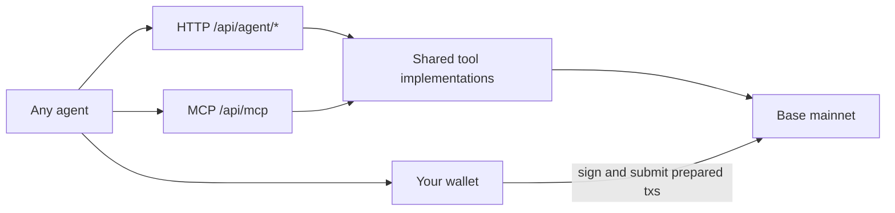

# Public agent API

Margin Call exposes six read-and-prepare tools over plain HTTP and over the Model Context
Protocol. They are **unauthenticated** and **wallet-agnostic**: no API key, no account, no
signup, and no assumption about which wallet you bring.

The protocol is the product. Agents interact with the same Base contracts as the website,
using a public read-and-prepare surface.

| Base URL |                                    |
| -------- | ---------------------------------- |
| HTTP     | `https://margincall.fun/api/agent` |
| MCP      | `https://margincall.fun/api/mcp`   |

## How it fits together



The public API/MCP service never holds a key, signs, or broadcasts. The optional
local wallet demo signs through its configured wallet provider. `prepare_open` hands back
ordinary unsigned Base calldata; a Dynamic server wallet, a Bankr agent wallet, a Coinbase
smart wallet, or a bare `viem` account can all execute the identical transactions. **Dynamic
is not required.** It is optional developer tooling for agents that start without a
wallet — see [Developer example](#developer-example-start-an-agent-without-a-wallet)
and [`src/lib/wallets/`](../src/lib/wallets/). Agents that already have a Base-capable
signer skip that section. Hosted API/MCP usage requires none of the local demo env vars.

Stock acquisition is also outside Margin Call. `prepare_open` only cares that the calling
wallet already holds the supported stock from `get_assets`. The Dynamic demo acquires that
token with Uniswap (`pnpm agent:wallet --acquire`). A Bankr-style agent should skip Uniswap,
swap with its own wallet tooling, verify the balance, and continue.

Hosted reads and quotes require no wallet, authentication, or caller-supplied RPC.
Preparation requires the intended wallet address; execution requires that wallet’s Base signer.
See the [in-app agent guide](https://margincall.fun/docs#agents) for the walkthrough.

## Conventions

- Every response is a discriminated union. Success is `{ "ok": true, ... }`; a refusal is
  `{ "ok": false, "code": "...", "message": "..." }`. Branch on `code`, never on prose.
- All on-chain integers are **decimal strings** in base units (`"1000000"`), so nothing is
  lost to floating point. Stock uses 8 decimals, USDC uses 6.
- Leverage is an integer in basis points: `10000` is spot, `12500` is 1.25x.
- Addresses are `0x`-prefixed and checksummed.
- Every endpoint answers `Access-Control-Allow-Origin: *`, so browser agents work too.

### Error codes

| Code                     | Meaning                                      | HTTP |
| ------------------------ | -------------------------------------------- | ---- |
| `INVALID_INPUT`          | Malformed argument                           | 400  |
| `UNKNOWN_ASSET`          | Not one of the launch rails                  | 400  |
| `UNSUPPORTED_LEVERAGE`   | Not a supported preset                       | 400  |
| `THESIS_TOO_LONG`        | Over 280 UTF-8 bytes                         | 400  |
| `POSITION_NOT_FOUND`     | Burned or never minted                       | 404  |
| `BASE_UNAVAILABLE`       | Base RPC could not be reached                | 502  |
| `PRICING_UNAVAILABLE`    | No fresh U.S. equity price to borrow against | 200  |
| `INSUFFICIENT_CREDIT`    | The pool cannot fund this principal          | 200  |
| `INSUFFICIENT_BALANCE`   | The wallet does not hold enough stock        | 200  |
| `ASSET_OPENING_DISABLED` | New opens are paused for this asset          | 200  |
| `SIMULATION_FAILED`      | Base did not confirm the open would succeed  | 200  |

The last five answer **200 on purpose**. "Fresh U.S. equity pricing is unavailable" is a
correct statement about Base, not a failed request, and a closed U.S. market must not look
like an outage to a client that only reads the status line. The same is true when a
supported rail is temporarily closed to new positions: `get_assets` still lists it,
existing positions remain manageable, and `quote_open` / `prepare_open` return
`ASSET_OPENING_DISABLED` until opening is enabled again. Over MCP the same split shows up
as `isError`: caller mistakes are tool errors, protocol refusals are answers.

## Pricing: live vs unavailable

Financed opens need a fresh price **and** an asset that still accepts new mints.
`canOpenLeveragedPosition` is true only when both are true. The oracle distinguishes
held from invalid readings, but that is protocol detail — the agent surface collapses
both into `pricing: "unavailable"`, because the decision is identical either way.

```jsonc
// Weekday, U.S. market open, asset accepting new positions
{
  "ok": true,
  "asset": "NVDAc",
  "pricing": "live",
  "openingEnabled": true,
  "canOpenLeveragedPosition": true
}

// Weekend, holiday, or a pricing interruption
{
  "ok": true,
  "asset": "NVDAc",
  "pricing": "unavailable",
  "openingEnabled": true,
  "canOpenLeveragedPosition": false,
  "reason": "Fresh U.S. equity pricing is unavailable."
}

// Supported rail, temporarily closed to new positions
{
  "ok": true,
  "asset": "NVDAc",
  "pricing": "live",
  "openingEnabled": false,
  "canOpenLeveragedPosition": false,
  "reason": "Opening new positions is currently disabled for NVDAc."
}
```

When pricing is unavailable, **refusing to open a leveraged position is the correct
outcome.** Do not silently fall back to spot to force a financed request through; say that
pricing is unavailable and stop. Spot (`10000`) borrows nothing and never consults the
oracle on-chain, so it stays openable while pricing is stale — but only offer it if that
is what the user asked for, and only while `openingEnabled` is true.

## HTTP endpoints

### `GET /api/agent/assets`

Curated launch assets, canonical addresses, and the supported leverage presets. Reads no
chain state, so it works before you have an RPC.

```bash
curl https://margincall.fun/api/agent/assets
```

```jsonc
{
  "ok": true,
  "chainId": 8453,
  "network": "base",
  "contracts": {
    "marginCall": "0x67D0c45F6fE166d80039f98776116F1a9aF00115",
    "creditPool": "0xd03D470a84ea91D084eF04137bb415d50B58768f",
    "usdc": "0x833589fCD6eDb6E08f4c7C32D4f71b54bdA02913",
  },
  "decimals": { "stock": 8, "usdc": 6 },
  "leveragePresets": [
    { "label": "1.0x", "bps": 10000, "financed": false },
    { "label": "1.25x", "bps": 12500, "financed": true },
    // 1.1x, 1.4x, 1.5x omitted for brevity
  ],
  "assets": [
    {
      "name": "NVDAc",
      "symbol": "NVDA",
      "assetId": 1,
      "stock": "0xb20000000000000000000078ee7ce2fE4908108C",
      "oracleAdapter": "0xbd3EEfD0eaC20639f3c776B1FD06A625e6F460ce",
      "executionAdapter": "0xeeC2E50277538E7451610FEBc86442601A83809d",
    },
    // AAPLc, METAc, GOOGLc
  ],
}
```

### `GET /api/agent/market-state`

Whether one asset can back a financed open right now. Takes `?asset=NVDAc` or `?assetId=1`.
`canOpenLeveragedPosition` is true only when pricing is live and `openingEnabled` is true.

```bash
curl "https://margincall.fun/api/agent/market-state?asset=NVDAc"
```

### `GET /api/agent/credit-pool`

USDC the pool can still lend. An open needs its whole principal available at once, so this
is the ceiling on a single financed position.

```bash
curl https://margincall.fun/api/agent/credit-pool
```

```json
{
  "ok": true,
  "availableCredit": "18779854",
  "availableCreditUsdc": "18.779854",
  "creditPool": "0xd03D470a84ea91D084eF04137bb415d50B58768f",
  "token": "0x833589fCD6eDb6E08f4c7C32D4f71b54bdA02913",
  "decimals": 6,
  "chainId": 8453
}
```

### `POST /api/agent/quote-open`

How a requested open would be sized. Needs no wallet — sizing depends on price, leverage,
and pool credit, not on who is asking.

```bash
curl -X POST https://margincall.fun/api/agent/quote-open \
  -H 'Content-Type: application/json' \
  -d '{"asset":"NVDAc","stockAmount":"1000000","leverage":12500}'
```

```json
{
  "ok": true,
  "asset": "NVDAc",
  "leverage": 12500,
  "leverageLabel": "1.25x",
  "financed": true,
  "pricing": "live",
  "canOpen": true,
  "stockAmount": "1000000",
  "contributionValue": "2000000",
  "estimatedPrincipal": "495000",
  "estimatedExposure": "2495000",
  "availableCredit": "18779854"
}
```

`estimatedPrincipal` matches the contract's own sizing, including the adverse-bound haircut,
so it is an estimate of the borrow rather than a promise about fill price. A supported asset
can still refuse here: when `openingEnabled` is false, both spot and financed quotes return
`ASSET_OPENING_DISABLED`.

### `GET /api/agent/position/{tokenId}`

Live Position NFT state from Base: owner, stock, principal, current debt, thesis, and health.

```bash
curl https://margincall.fun/api/agent/position/2
```

```json
{
  "ok": true,
  "tokenId": "2",
  "asset": "NVDAc",
  "symbol": "NVDA",
  "assetId": 1,
  "stockAmount": "1098722",
  "principal": "220146",
  "currentDebt": "220178",
  "owner": "0xbD78783a26252bAf756e22f0DE764dfDcDa7733c",
  "executor": "0x0000000000000000000000000000000000000000",
  "thesis": "",
  "nav": null,
  "liquidatable": null,
  "pricing": "unavailable",
  "stage": "pricing_unavailable"
}
```

`nav` and `liquidatable` are `null` rather than guessed when pricing is stale. This is not
[`GET /api/nft/{tokenId}`](../src/app/api/nft/), which serves marketplace metadata and
deliberately withholds debt and NAV.

### `POST /api/agent/prepare-open`

Unsigned transactions that open a position for a wallet you control.

```bash
curl -X POST https://margincall.fun/api/agent/prepare-open \
  -H 'Content-Type: application/json' \
  -d '{
    "wallet": "0xBe523e724B9Ea7D618dD093f14618D90c4B19b0c",
    "assetId": 1,
    "stockAmount": "1000000",
    "leverage": 12500,
    "thesis": "AI infrastructure demand remains strong"
  }'
```

```jsonc
{
  "ok": true,
  "wallet": "0xBe523e724B9Ea7D618dD093f14618D90c4B19b0c",
  "asset": "NVDAc",
  "leverage": 12500,
  "financed": true,
  "pricing": "live",
  "stockAmount": "1000000",
  "contributionValue": "2000000",
  "estimatedPrincipal": "495000",
  "thesis": "AI infrastructure demand remains strong",
  "transactions": [
    {
      "kind": "approve",
      "to": "0xb20000000000000000000078ee7ce2fE4908108C",
      "data": "0x095ea7b3…",
      "value": "0",
      "chainId": 8453,
      "description": "Approve MarginCall to move 0.01 NVDAc.",
      "simulated": false,
    },
    {
      "kind": "open",
      "to": "0x67D0c45F6fE166d80039f98776116F1a9aF00115",
      "data": "0xa7433fd0…",
      "value": "0",
      "chainId": 8453,
      "description": "Open a 1.25x NVDAc position with 0.01 NVDAc.",
      "simulated": false,
    },
  ],
  "note": "These transactions are unsigned. Submit them in order from the given wallet with any Base-capable signer. Margin Call never signs or broadcasts.",
}
```

Notes on the shape:

- Submit the transactions **in order**. The approve appears only when the existing allowance
  is short; when it is already sufficient you get a single `open`.
- `simulated` says whether Base was asked to dry-run that exact call. The open is simulated
  when no approve is needed. When an approve must land first, a dry run would revert on an
  allowance you have not granted yet, so it is skipped and reported honestly.
- A reverted simulation is returned as a structured code — `PRICING_UNAVAILABLE`,
  `INSUFFICIENT_CREDIT`, and so on — never as raw revert data.
- Signing and submitting is entirely yours. Margin Call has no key and cannot broadcast.

Executing the prepared transactions with `viem`:

```ts
import { createPublicClient, createWalletClient, http } from "viem";
import { base } from "viem/chains";
import { privateKeyToAccount } from "viem/accounts";

const account = privateKeyToAccount(process.env.PRIVATE_KEY as `0x${string}`);
const wallet = createWalletClient({ account, chain: base, transport: http() });

const publicClient = createPublicClient({ chain: base, transport: http() });

const response = await fetch("https://margincall.fun/api/agent/prepare-open", {
  method: "POST",
  headers: { "Content-Type": "application/json" },
  body: JSON.stringify({
    wallet: account.address,
    assetId: 1,
    stockAmount: "1000000",
    leverage: 12500,
  }),
});
const result = await response.json();
// Protocol refusals can use HTTP 200. Never submit a refused preparation.
if (!response.ok || result.ok !== true) {
  throw new Error(
    `${result.code ?? response.status}: ${result.message ?? "Preparation failed"}`
  );
}

for (const tx of result.transactions) {
  if (tx.chainId !== base.id) throw new Error("Expected Base transactions");
  const hash = await wallet.sendTransaction({
    to: tx.to,
    data: tx.data,
    value: BigInt(tx.value),
  });
  const receipt = await publicClient.waitForTransactionReceipt({ hash });
  if (receipt.status !== "success") {
    throw new Error(`Transaction reverted: ${hash}`);
  }
}
```

## MCP

The same six tools are served as a Streamable HTTP MCP endpoint at
`https://margincall.fun/api/mcp`. No OAuth, no API key, no stdio server to install.

For a client supporting remote Streamable HTTP MCP (using its MCP configuration):

```json
{
  "mcpServers": {
    "margin-call": {
      "url": "https://margincall.fun/api/mcp"
    }
  }
}
```

| Tool               | Purpose                                        |
| ------------------ | ---------------------------------------------- |
| `get_assets`       | Supported stocks, addresses, leverage presets  |
| `get_market_state` | Can this asset back a financed open right now? |
| `get_credit_pool`  | How much USDC the pool can lend                |
| `quote_open`       | Size a prospective open                        |
| `get_position`     | Read one Position NFT                          |
| `prepare_open`     | Unsigned calldata to open a position           |

A raw JSON-RPC call, for clients you are wiring by hand:

```bash
curl -X POST https://margincall.fun/api/mcp \
  -H 'Content-Type: application/json' \
  -H 'Accept: application/json, text/event-stream' \
  -d '{"jsonrpc":"2.0","id":1,"method":"tools/call",
       "params":{"name":"get_market_state","arguments":{"asset":"NVDAc"}}}'
```

## A complete open

Hold the supported stock in your wallet first. How you acquired it does not matter. The
Dynamic reference path is `pnpm agent:wallet --acquire` (Uniswap). A Bankr-style agent skips
that and uses its own swap. Margin Call only checks the balance at `prepare_open`.

1. `get_assets` — pick an asset and a leverage preset.
2. `get_market_state` — if you want leverage and `canOpenLeveragedPosition` is false, stop and say so.
3. `quote_open` — confirm the principal and that the pool can fund it.
4. `prepare_open` — get the unsigned transactions.
5. Sign and submit them with your own wallet, in order.
6. `get_position` — read the minted Position NFT.

The first reference demo uses a single financed preset: **1.25x** (`leverage: 12500`). Do not
fall back to 1.0x when pricing is unavailable — refusing is the correct outcome.

### Already have a wallet (Bankr, Coinbase, viem, …)

Skip Dynamic. You do not call `pnpm agent:wallet`. Point your signer at the same HTTP or MCP
surface, then broadcast the prepared `{ to, data, value }` objects as ordinary Base
transactions. Margin Call never learns which provider signed.

```bash
# market gate
curl "https://margincall.fun/api/agent/market-state?asset=NVDAc"

# when canOpenLeveragedPosition is true:
curl -X POST https://margincall.fun/api/agent/prepare-open \
  -H 'Content-Type: application/json' \
  -d '{"wallet":"0xYourAddress","asset":"NVDAc","stockAmount":"1000000","leverage":12500,"thesis":"Agent-opened"}'
```

Submit `transactions` in order from that wallet. Decode `PositionOpened` from the open receipt
for the token id, then `GET /api/agent/position/{tokenId}`.

### Developer example: start an agent without a wallet

This section is for developers who want to run the Margin Call reference implementation
locally. You do not need to clone the repository or use Dynamic to call Margin Call’s
public API or MCP.

If your agent already has a Base-capable wallet, skip this section.

The reference implementation uses Dynamic to provision a server wallet so you can see
how a walletless agent could be built. Dynamic is not a Margin Call dependency.

Clone the repository first:

```bash
git clone https://github.com/hurley87/margin-call.git
cd margin-call
pnpm install
```

These environment variables are local developer configuration for this reference
implementation. They are not needed for the hosted Margin Call API or MCP:

- `DYNAMIC_ENVIRONMENT_ID` (or `NEXT_PUBLIC_DYNAMIC_ENVIRONMENT_ID`)
- `DYNAMIC_API_TOKEN`
- `DYNAMIC_WALLET_PASSWORD`
- `UNISWAP_API_KEY`
- optional `BASE_RPC_URL`

In Dynamic, enable embedded wallets and multiple embedded wallets per chain. Keep
credentials server-side. Set `UNISWAP_API_KEY` for acquisition. A provisioned
`BASE_RPC_URL` is recommended; the demo otherwise uses `NEXT_PUBLIC_BASE_RPC_URL`
or the public Base RPC.

```bash
# Provision or resolve a Base wallet
pnpm agent:wallet

# After manually funding the address with Base ETH + USDC:
pnpm agent:wallet --acquire --asset NVDAc --usdc 2

# When fresh market pricing is available:
pnpm agent:wallet --open --asset NVDAc
```

The open command defaults to the wallet's full stock balance; `--stock` accepts a
human decimal amount to limit it. Combined `--acquire --open` runs acquisition
before the open pricing gate, so acquisition may succeed even when opening is refused.

Those commands provision or reuse the Dynamic server wallet, check market state, and —
only when pricing is live — sign the prepared 1.25x open. The Position NFT is minted to
that Dynamic address because it is the transaction sender. `--acquire` can precede
`--open` in the same invocation if the wallet still needs stock.

When pricing is unavailable the demo prints
`Fresh U.S. equity pricing is unavailable, so I will not open a leveraged position.`
and exits successfully without submitting.

## Limits

- Read and prepare only. There is no `repay`, `close`, `reduce_exposure`, or `liquidate`
  tool yet. Repay and close are available in the website; liquidation exists on-chain.
- No rate limits are advertised. Be reasonable — every read hits Base.
- Base mainnet only (`chainId` 8453).
